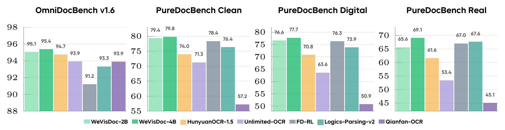

# WeVisDoc

[English](README.md) | [简体中文](README.zh-CN.md)

<p align="center">
  <a href="https://github.com/Tencent/WeVisDoc"></a>
  <a href="https://tencent.github.io/WeVisDoc"></a>
  <a href="https://huggingface.co/Tencent/WeVisDoc-4B"></a>
  <a href="https://huggingface.co/Tencent/WeVisDoc-2B"></a>
  <a href="#" title="Coming soon"></a>
</p>

WeVisDoc is an end-to-end document parser for page images. Fine-tuned from [Qwen3-VL-2B-Instruct](https://huggingface.co/Qwen/Qwen3-VL-2B-Instruct) and [Qwen3-VL-4B-Instruct](https://huggingface.co/Qwen/Qwen3-VL-4B-Instruct), it turns a page into structured Markdown, with LaTeX formulas and HTML tables.

WeVisDoc-4B achieves an Overall score of 95.38 on OmniDocBench v1.6 and a mean Overall score of 75.54 across the three PureDocBench tracks, ranking first among the compared end-to-end parsers in all four settings.

<p align="center">
  
</p>
<p align="center"><em>WeVisDoc-4B leads the compared end-to-end parsers across all four reported settings. Bars show scores on OmniDocBench v1.6 and PureDocBench Clean, Digital, and Real.</em></p>

## Evaluation

The following tables include end-to-end document parsing specialists only. WeVisDoc results are means over three inference runs.

### OmniDocBench v1.6

| Model | Params | Overall ↑ | TextEdit ↓ | FormulaCDM ↑ | TableTEDS ↑ | TableTEDS_S ↑ | ROEdit ↓ |
| --- | ---: | ---: | ---: | ---: | ---: | ---: | ---: |
| Nanonets-OCR2* | 3B | 83.20 | 0.108 | 80.35 | 80.10 | 85.26 | 0.211 |
| OCRFlux-3B* | 3B | 83.31 | 0.126 | 88.75 | 73.78 | 77.98 | 0.217 |
| POINTS-Reader | 3B | 83.37 | 0.096 | 85.72 | 73.98 | 77.40 | 0.198 |
| Nanonets-OCR-s | 3B | 83.61 | 0.108 | 81.46 | 80.18 | 84.51 | 0.213 |
| olmOCR-2-7B* | 7B | 85.51 | 0.106 | 88.84 | 78.32 | 82.81 | 0.223 |
| olmOCR | 7B | 85.74 | 0.139 | 88.10 | 83.00 | 87.17 | 0.216 |
| DeepSeek-OCR* | 3B | 86.31 | 0.077 | 84.71 | 81.87 | 86.07 | 0.171 |
| OCRVerse | 4B | 88.60 | 0.063 | 89.61 | 82.44 | 86.27 | 0.163 |
| UniRec-0.1B* | 0.1B | 88.91 | 0.088 | 92.14 | 83.40 | 86.79 | 0.146 |
| DeepSeek-OCR 2 | 3B | 90.25 | 0.050 | 91.84 | 83.89 | 87.75 | 0.144 |
| dots.ocr | 3B | 90.77 | 0.048 | 89.95 | 87.18 | 90.58 | 0.138 |
| FD-RL* | 4B | 91.21 | 0.055 | 92.92 | 86.22 | 90.92 | 0.145 |
| HunyuanOCR | 1B | 92.03 | 0.048 | 88.60 | 92.37 | 93.99 | 0.138 |
| dots.mocr* | 3B | 92.57 | 0.042 | 92.09 | 89.78 | 92.92 | 0.133 |
| FireRed-OCR | 2B | 93.26 | 0.037 | 95.44 | 88.04 | 91.06 | 0.131 |
| Logics-Parsing-v2 | 4B | 93.33 | 0.041 | 95.65 | 88.42 | 91.98 | 0.137 |
| Qianfan-OCR | 4B | 93.90 | 0.040 | 95.08 | 90.53 | 93.31 | 0.130 |
| Unlimited-OCR | 3B-A0.5B | 93.92 | 0.042 | 95.79 | 90.16 | 93.32 | 0.129 |
| HunyuanOCR-1.5 | 1B | 94.74 | 0.039 | 94.50 | 93.67 | 94.71 | 0.129 |
| **WeVisDoc-2B** | **2B** | **95.06** | **0.038** | **95.94** | **93.03** | **95.26** | **0.130** |
| **WeVisDoc-4B** | **4B** | **95.38** | **0.036** | **96.81** | **92.95** | **95.34** | **0.125** |

### PureDocBench

| Model | Params | Avg₃ ↑ | Clean Overall ↑ | Digital Degraded Overall ↑ | Real Degraded Overall ↑ |
| --- | ---: | ---: | ---: | ---: | ---: |
| OCRFlux-3B | 3B | 42.06 | 47.14 | 41.82 | 37.21 |
| DeepSeek-OCR | 3B | 46.98 | 53.50 | 46.95 | 40.48 |
| UniRec-0.1B | 0.1B | 48.59 | 58.91 | 52.42 | 34.44 |
| POINTS-Reader* | 3B | 49.24 | 53.78 | 51.24 | 42.69 |
| DeepSeek-OCR-2 | 3B | 49.51 | 55.53 | 49.41 | 43.60 |
| Qianfan-OCR | 4B | 51.04 | 57.22 | 50.85 | 45.06 |
| olmOCR-7B | 7B | 55.90 | 62.56 | 57.84 | 47.30 |
| Nanonets-OCR2 | 3B | 58.36 | 64.83 | 61.23 | 49.03 |
| HunyuanOCR | 1B | 60.56 | 65.61 | 61.49 | 54.58 |
| Unlimited-OCR* | 3B-A0.5B | 62.76 | 71.28 | 63.62 | 53.39 |
| olmOCR-2-7B | 7B | 63.78 | 69.36 | 65.87 | 56.10 |
| dots.ocr | 3B | 64.55 | 72.01 | 65.95 | 55.68 |
| Nanonets-OCR-s* | 3B | 65.37 | 71.26 | 66.56 | 58.28 |
| FireRed-OCR | 2B | 65.57 | 70.81 | 68.49 | 57.42 |
| HunyuanOCR-1.5* | 1B | 68.79 | 73.98 | 70.81 | 61.59 |
| OCRVerse | 4B | 69.40 | 73.18 | 71.36 | 63.66 |
| dots.mocr | 3B | 70.39 | 76.27 | 73.16 | 61.73 |
| Logics-Parsing-v2 | 4B | 72.61 | 76.35 | 73.85 | 67.64 |
| FD-RL | 4B | 73.92 | 78.38 | 76.33 | 67.04 |
| **WeVisDoc-2B** | **2B** | **73.86** | **79.36** | **76.62** | **65.60** |
| **WeVisDoc-4B** | **4B** | **75.54** | **79.81** | **77.74** | **69.08** |

`Avg₃` is the mean of the three PureDocBench track-level Overall scores. `*` marks baseline results obtained with our evaluation pipeline; unmarked baseline results are taken from the corresponding papers.

## Quick start

Python 3.10+ is required. Install the vLLM and client dependencies:

```bash
python -m venv .venv
source .venv/bin/activate
python -m pip install -r requirements-vllm.txt
```

Start the service in the first terminal:

```bash
bash scripts/serve_vllm.sh Tencent/WeVisDoc-2B
```

Use `Tencent/WeVisDoc-4B` instead to run the 4B version.

Then process all bundled images from a second terminal:

```bash
source .venv/bin/activate
bash scripts/run_demo.sh
```

Predictions are written to `outputs/predictions/`.

## Serve with vLLM

```bash
python -m venv .venv
source .venv/bin/activate
python -m pip install -r requirements-vllm.txt
bash scripts/serve_vllm.sh Tencent/WeVisDoc-2B
```

Replace the model ID with `Tencent/WeVisDoc-4B` to serve the 4B version. The launcher requires vLLM >=0.11.1. Extra arguments are passed to vLLM. To expose the service on the network, set `HOST=0.0.0.0`. For two GPUs and a larger context:

```bash
CUDA_VISIBLE_DEVICES=0,1 TENSOR_PARALLEL_SIZE=2 MAX_MODEL_LEN=65536 \
  bash scripts/serve_vllm.sh Tencent/WeVisDoc-4B --dtype bfloat16
curl --fail http://127.0.0.1:8000/health
```

| Environment variable | Default | Meaning |
| --- | --- | --- |
| `WEVISDOC_MODEL_PATH` / `MODEL_PATH` | Unset | Model ID or checkpoint; positional argument takes precedence, then `WEVISDOC_MODEL_PATH` |
| `SERVED_MODEL_NAME` | `wevisdoc` | API model alias; also read by the client |
| `HOST` / `PORT` | `127.0.0.1` / `8000` | Listening address |
| `TENSOR_PARALLEL_SIZE` | `1` | Number of tensor-parallel GPUs |
| `MAX_MODEL_LEN` | `32768` | Total context budget: text, image and output tokens |
| `GPU_MEMORY_UTILIZATION` | `0.9` | GPU memory fraction |
| `MAX_NUM_SEQS` | `8` | Maximum concurrent sequences |
| `OMP_NUM_THREADS` | `1` | CPU preprocessing threads |
| `VLLM_API_KEY` | Unset | Optional server authentication, handled by vLLM |

Use a separate virtual environment from Transformers to avoid conflicting PyTorch packages.

## Call the service

A client machine only needs `python -m pip install -r requirements.txt`. The examples expect PNG, JPEG, or WebP page images:

```bash
python -m wevisdoc.client --image page.png --output results/page.md
python -m wevisdoc.client --image-dir images --result-dir results --workers 4
```

`--image-dir` processes images in that directory (not recursively) and writes one Markdown file per image, such as `results/page.png.md`. Existing nonempty results are skipped unless `--overwrite` is set.

To process every bundled image in `demos/inputs/`:

```bash
OPENAI_BASE_URL=http://127.0.0.1:8000/v1 \
  bash scripts/run_demo.sh --workers 4
```

The demo writes one Markdown file per image to `outputs/predictions/`.

The client reads `OPENAI_BASE_URL` (default `http://127.0.0.1:8000/v1`), `OPENAI_API_KEY` (default `EMPTY`), and `SERVED_MODEL_NAME`. Match `OPENAI_API_KEY` to `VLLM_API_KEY` when authentication is enabled.

Override defaults with `--base-url`, `--model`, `--timeout` (600 seconds), `--temperature` (0), or `--max-tokens` (8192). Increase the token or context budget if output is truncated; reduce image size, context, or concurrency if GPU memory is insufficient.

## Local Transformers inference

Use a separate environment from vLLM:

```bash
python -m pip install -r requirements-local.txt
python -m wevisdoc.local --model Tencent/WeVisDoc-2B \
  --image page.png --output results/page.md
```

Use `Tencent/WeVisDoc-4B` for the 4B version. `--model` can be omitted when `WEVISDOC_MODEL_PATH` is set. Local inference supports `--device-map` (default `auto`) and `--max-tokens` (8192). Render PDFs to page images first.
